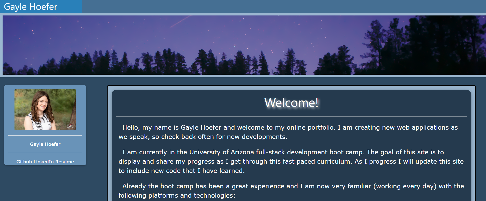

# Gayle Hoefer Portfollio



## Table of Contents  
* [Description](##Description)  
* [Usage](##Usage)  
* [Installation](##Installation)  
* [License](##License)  
* [Contact](##Contact)  

## Description

This document is used to display the projects that Gayle Hoefer has created. This website is used so that future employer can see what is possible when hiring Gayle. I was able to learn how to link the webpage to its self. This was the first interation of the portfollio.

## Usage

This project is to be used to show off the work done by Gayle Hoefer

## Installation

1. Clone the repo
   ```sh
   git clone https://github.com/hoeferg/GaylePortfolio
   ```
2. Install NPM packages
   ```sh
   npm install
   ```
3. Start the application
   ```sh
   npm start


## License

No license

---

## Contact
Gayle Hoefer - [LinkedIn](https://www.linkedin.com/in/gayle-hoefer-61a2a3124/) - [Github](https://github.com/hoeferg)

---


